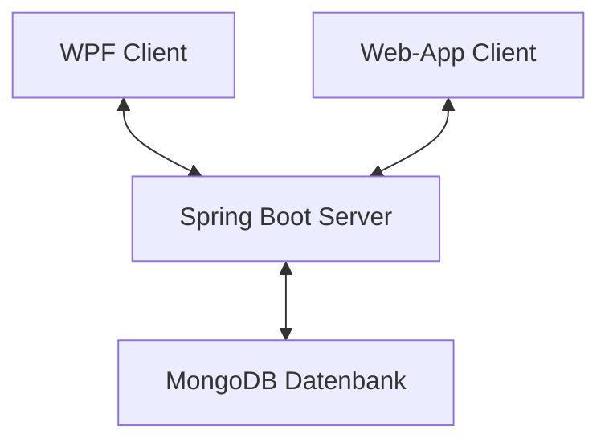

# POS Projekt 2024 - Notiz App - Tobias Ziller

**Dies ist die Dokumentation des POS-Projekts welches von Tobias Ziller geplant, implementiert und dokumentiert wurde.**

## Softwarearchitektur

Der Grundbaustein der API bildet ein Spring-Boot Server welcher die Verbindung zu einer MongoDB Datenbank bereitstellt. Mithilfer der zwei Clients kann man somit auf die Datenbank zugreifen. Einer wurde im C# und WPF entwickelt. Der Zweite wurde im Spring-Boot Projekt mittels HTML, CSS und JavaScript entworfen.

## Beschreibung der Software

Die Notizapp macht es den Benutzer (Client) möglich, mittels Desktop-App oder Webapp, Notizen in der Datenbank zu verwalten. Er hat die Funktionen Daten abzufragen, zu speichern, zu ändern ,oder Daten zu löschen. Die Funktionen senden von der Clientanwendung einen AJAX befehl an den Server, welcher wiederum die angegebene Funktion ausführt.

## Funktionen der WebApp

### Erstellen einer Notiz

 
Um eine neu Notiz zu speichern muss man zuerst den blauen Plus-Button drücken, wie in Bild 1 dargestellt.   
Beim drücken des Knopfs öffnet sich ein Fenster welches die Knöpfe Speichern, Abbrechen und Löschen enthält. Beim drücken von Speichern wird die Notiz gespeichert, egal ob man gerade eine neue Notiz erstellt oder eine bereits Vorhandene bearbeitet. Beim drücken vom Abbrechen Knopf wird das Fenster zum hinzufügen/bearbeiten zugeklappt. Wenn man den Löschen Knopf drückt wird die aktuelle Notiz aus der Datenbank gelöscht.

### Anzeigen der Notizen

 
Wenn eine Notiz via WebApp oder DesktopApp in der Datenbank angelegt hat, kann man diese wieder anzeigen lassen, wenn man auf den Knopf mit dem Titel der benötigten Notiz drückt.   So kann man beispielsweise die Notiz löschen oder aktualisieren.

### Ändern einer Notiz

 
Um eine Notiz zu Ändern muss man wie im Schritt zuvor eine der bereits vorhandenen Notizen auswählen und entweder den Inhalt oder den Titel der Notiz bearbeiten.  Um das ganze dann in der Datenbank zu Speichern muss man nur noch den Speichern Knopf drücken- Dann sendet die Anwendung ein Request and den Server, welcher die neuen Daten in die Datenbank speichert.

### Löschen der Notiz

 
Will man die Notiz doch Löschen, so drückt man einfach den Löschen Knopf und der Server empfängt den Befehl zum löschen der Notiz. 

## Funktionen der WPF-Anwendung

### Erstellen einer Notiz

 
Um eine neue Notiz hinzuzufügen muss man zuerst die Felder in Bild 1 ausfüllen und den Speichern Knopf drücken.   
Der Server legt dann automatisch eine neue Notiz an.

### Anzeigen einer Notz

 
Soll eine bereits vorhandene Notiz angezeigt werden, drückt der Benutzer die benötigte Notiz, wie in Bild 1, so werden die Daten der Notiz in den Feldern "Notiz Überschrift" und "Notiz Inhalt" angezeigt. 

### Ändern einer Notiz

 
Um eine Notiz zu ändern muss man zuerst eine Notiz, wie beim Anzeigen, auswählen. Dann kann man einfach die zu Ändernden Daten umschreiben, und der Server ändert die Daten in der Datenbank. 

###  Löschen einer Notiz

 
Will der Benutzer eine Notiz aus der Datenbank entfernen muss er zuerst eine Notiz auswählen, wie in Bild 1, und den Löschen Knopf drücken. Danach wird ein Befehl an den Server geschickt, welcher wiederum die zu löschenden Daten aus der Datenbank entfernt. 

## API-Beschreibung

