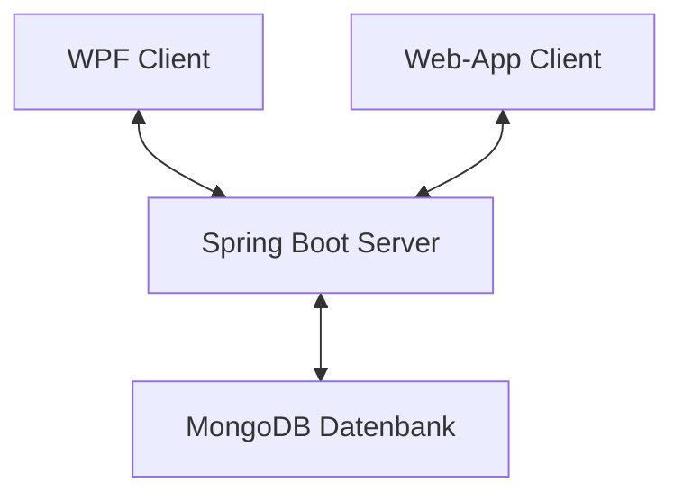
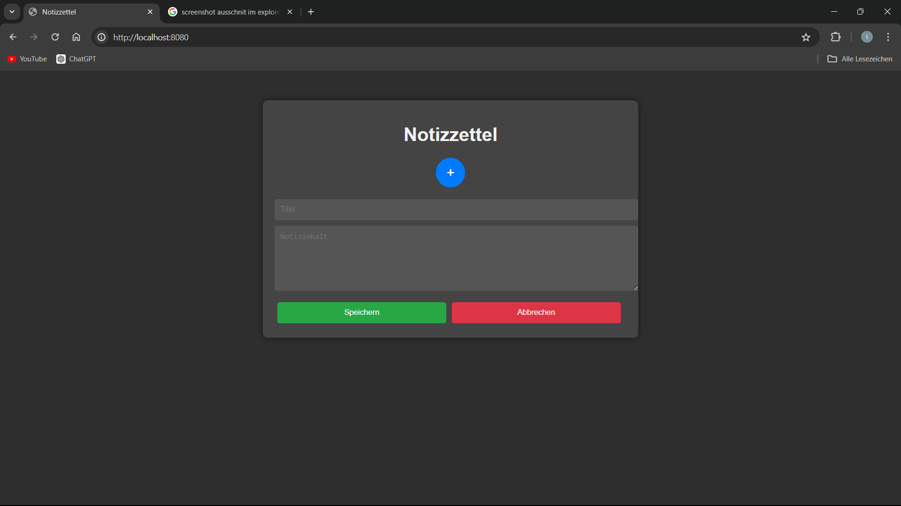

# POS Projekt 2024 - Notiz App - Tobias Ziller

**Dies ist die Dokumentation des POS-Projekts welches von Tobias Ziller geplant, implementiert und dokumentiert wurde.**

## Softwarearchitektur

Der Grundbaustein der API bildet ein Spring-Boot Server welcher die Verbindung zu einer MongoDB Datenbank bereitstellt. Mithilfer der zwei Clients kann man somit auf die Datenbank zugreifen. Einer wurde im C# und WPF entwickelt. Der Zweite wurde im Spring-Boot Projekt mittels HTML, CSS und JavaScript entworfen.

## Beschreibung der Software

Die Notizapp macht es den Benutzer (Client) möglich, mittels Desktop-App oder Webapp, Notizen in der Datenbank zu verwalten. Er hat die Funktionen Daten abzufragen, zu speichern, zu ändern ,oder Daten zu löschen. Die Funktionen senden von der Clientanwendung einen AJAX befehl an den Server, welcher wiederum die angegebene Funktion ausführt.

## Funktionen der WebApp

### Erstellen einer Notiz

