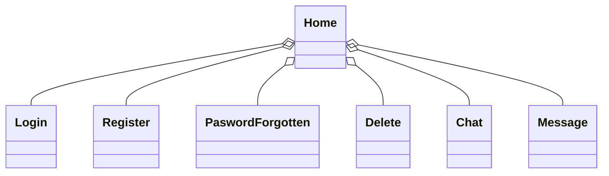

# POS Projekt 2024 - Notiz App - Tobias Ziller

**Dies ist die Dokumentation des POS-Projekts welches von Tobias Ziller geplant, implementiert und dokumentiert wurde.**

## Softwarearchitektur

Der Grundbaustein der API bildet ein Spring-Boot Server welcher die Verbindung zu einer MongoDB Datenbank bereitstellt. Mithilfer der zwei Clients kann man somit auf die Datenbank zugreifen. Einer wurde im C# und WPF entwickelt. Der Zweite wurde im Spring-Boot Projekt mittels HTML, CSS und JavaScript entworfen.


## Beschreibung der Software

Die Notizapp macht es den Benutzer (Client) möglich, mittels Desktop-App oder Webapp, Notizen in der Datenbank zu verwalten. Er hat die Funktionen Daten abzufragen, zu speichern, zu ändern ,oder Daten zu löschen. Die Funktionen senden von der Clientanwendung einen AJAX befehl an den Server, welcher wiederum die angegebene Funktion ausführt.

## Funktionen der WebApp

### Erstellen einer Notiz


<br>
Um eine neu Notiz zu speichern muss man zuerst den blauen Plus-Button drücken, wie in Bild 1 dargestellt. <br> 
Beim drücken des Knopfs öffnet sich ein Fenster welches die Knöpfe Speichern, Abbrechen und Löschen enthält. Beim drücken von Speichern wird die Notiz gespeichert, egal ob man gerade eine neue Notiz erstellt oder eine bereits Vorhandene bearbeitet. Beim drücken vom Abbrechen Knopf wird das Fenster zum hinzufügen/bearbeiten zugeklappt. Wenn man den Löschen Knopf drückt wird die aktuelle Notiz aus der Datenbank gelöscht.

### Anzeigen der Notizen

<br>
Wenn eine Notiz via WebApp oder DesktopApp in der Datenbank angelegt hat, kann man diese wieder anzeigen lassen, wenn man auf den Knopf mit dem Titel der benötigten Notiz drückt. <br> So kann man beispielsweise die Notiz löschen oder aktualisieren.

### Ändern einer Notiz


<br>
Um eine Notiz zu Ändern muss man wie im Schritt zuvor eine der bereits vorhandenen Notizen auswählen und entweder den Inhalt oder den Titel der Notiz bearbeiten.<br> Um das ganze dann in der Datenbank zu Speichern muss man nur noch den Speichern Knopf drücken- Dann sendet die Anwendung ein Request and den Server, welcher die neuen Daten in die Datenbank speichert.

### Löschen der Notiz


<br>
Will man die Notiz doch Löschen, so drückt man einfach den Löschen Knopf und der Server empfängt den Befehl zum löschen der Notiz.<br>

## Funktionen der WPF-Anwendung

### Erstellen einer Notiz


<br>
Um eine neue Notiz hinzuzufügen muss man zuerst die Felder in Bild 1 ausfüllen und den Speichern Knopf drücken. <br> 
Der Server legt dann automatisch eine neue Notiz an.

### Anzeigen einer Notz


<br>
Soll eine bereits vorhandene Notiz angezeigt werden, drückt der Benutzer die benötigte Notiz, wie in Bild 1, so werden die Daten der Notiz in den Feldern "Notiz Überschrift" und "Notiz Inhalt" angezeigt.<br>

### Ändern einer Notiz


<br>
Um eine Notiz zu ändern muss man zuerst eine Notiz, wie beim Anzeigen, auswählen. Dann kann man einfach die zu Ändernden Daten umschreiben, und der Server ändert die Daten in der Datenbank.<br>

###  Löschen einer Notiz


<br>
Will der Benutzer eine Notiz aus der Datenbank entfernen muss er zuerst eine Notiz auswählen, wie in Bild 1, und den Löschen Knopf drücken. Danach wird ein Befehl an den Server geschickt, welcher wiederum die zu löschenden Daten aus der Datenbank entfernt.<br>

## API-Beschreibung

Der Server basiert auf dem REST-Prinzip und stellt die Endpoints GET-, POST-, PUT- und Delete-Endpoints zur Verfügung. Diese Endpoints stellen sicher, dass der Client mit der Datenbank kommunizieren kann.

### Endpunkte

<!-- Allgemeiner Endpoint -->
<details>
  <summary>/api []</summary>
  
  **Beschreibung:** Dieser Endpunkt muss vor jedem spezifischen Endpunkt stehen.
</details>

<details>
  <summary>/api/notiz [POST]</summary>
  
  **Beschreibung:** Ein Endpunkt zum speichern von Daten in der Datenbank.
  
  **JSON-Body:**
  ```json
    {
    "title": "Einkaufsliste",
    "text": "Eier"
    }
  ```

  **Return-Wert:**
  ```json
    {
    "id": "665ce1323672316c2f12ae5d",
    "title": "Einkaufsliste",
    "text": "Eier"
    }
  ```
</details>

<details>
  <summary>/api/notizen [GET]</summary>
  
  **Beschreibung:** Ein Endpunkt zu auslesen der Daten aus der DB.
  
  **JSON-Body:**
  Kein JSON-Body notwendig. ID der Notiz wird an den Pfad des Endpoints angehängt.

  **Return-Wert:**
  ```json
    [
    {
        "id": "665ccf0a13a6af2533257a78",
        "title": "Notiz Demo",
        "text": "Einkaufen gehen"
    },
    {
        "id": "665ce1323672316c2f12ae5d",
        "title": "Einkaufsliste",
        "text": "Eier"
    }
    ]
  ```
</details>

<details>
  <summary>/api/notiz/{id} [GET]</summary>
  
  **Beschreibung:** Ein Endpunkt um eine bestimmte Notiz von der Datenbank zu empfangen.

  **JSON-Body:**
  kein JSON-Body notwendig

  **Return-Wert:**
  ```json
    {
      "id": "665ccf0a13a6af2533257a78",
      "title": "Notiz Demo",
      "text": "Einkaufen gehen"
    }
  ```
</details>

<details>
  <summary>/api/notiz/{id} [DELETE]</summary>
  
  **Beschreibung:** Ein Endpunkt zum löschen einer Notiz.
  
  **JSON-Body:**
  Kein JSON-Body erforderlich. ID der Notiz wird an den Pfad des Endpoints angehängt.

  **Return-Wert:**
  Kein JSON-Returnwert.<br>
  Entweder Status-Code 200 --> OK oder Status-Code 500 --> Internal Server Error 

</details>

<details>
  <summary>/api/notiz [PUT]</summary>
  
  **Beschreibung:** Ein Endpunkt zu überschreiben einer bereits vorhandenen Notiz.
  
  **JSON-Body:**
  ```json
    {
    "id": "665ccf0a13a6af2533257a78",
    "title": "Notiz Demo",
    "text": "morgen Einkaufen gehen"
    }
  ```

  **Return-Wert:**
  ```json
    {
    "id": "665ccf0a13a6af2533257a78",
    "title": "Notiz Demo",
    "text": "morgen Einkaufen gehen"
    }
  ```
</details>

#### Weitere Endpunkte
Natürlich gäbe es noch einige weitere Endpunkte, welche in diesem Projekt aber nicht benötigt wurden.

##Verwendung der API


<details>
  <Summary>Datenbank</summary>

  **Beschreibung:** Aufbau der Speicherung in MongoDB

  **MongoDB Dokument:**
  ```json
    {
  "_id": {
    "$oid": "665ccf0a13a6af2533257a78"
  },
  "text": "morgen Einkaufen gehen",
  "title": "Notiz Demo"
}
  ```
</details>

</details>

<details>
  <Summary>Spring-Boot-Server</summary>

  **Beschreibung:** Endpoint Beispiel Spring-Boot-Server in Java

  **Java-Endpoint:**
  ```java
    @PostMapping("notiz")
    @ResponseStatus(HttpStatus.CREATED)
    public NotizDTO postNotiz(@RequestBody NotizDTO NotizDTO) {
        return notizService.save(NotizDTO);
    }
  ```
  Für die Aufteilung der Objekte sind im Hintergrund die NotizDTO- und Notiz-Klassen zuständig. Durch das Repository wird dann auf die MongoDB zugegriffen und da Objekt gespeichert. 
</details>

<details>
  <Summary>WPF</summary>

  **Beschreibung:** Posten der Notiz im WPF

  **C#:**
  ```csharp
    private async void AddNote()
{
    try
    {
        Notiz newNote = new Notiz { title = Ueberschrift.Text, text = Inhalt.Text };
        HttpClient client = new HttpClient();
        string json = JsonSerializer.Serialize(newNote);
        HttpResponseMessage response = await client.PostAsync(apiUrl + "/notiz", new StringContent(json, System.Text.Encoding.UTF8, "application/json"));
        response.EnsureSuccessStatusCode();
        MessageBox.Show("Notiz erfolgreich hinzugefügt.", "Success", MessageBoxButton.OK, MessageBoxImage.Information);
        LoadNotes();
    }
    catch (HttpRequestException ex)
    {
        MessageBox.Show($"Error beim hinzufügen der Notiz: {ex.Message}", "Error", MessageBoxButton.OK, MessageBoxImage.Error);
    }
}
  ```
  Diese Methode fügt eine neue Notiz hinzu, indem sie über einen HTTP-Client eine Anfrage an den Endpoint sendet. Der Titel und der Text der Notiz werden aus den entsprechenden Textfeldern entnommen und in ein Notiz-Objekt konvertiert. Anschließend wird das Notiz-Objekt in JSON serialisiert und eine POST-Anfrage an den Server gesendet. Die Methode wartet auf die Antwort des Servers und stellt sicher, dass die Anfrage erfolgreich war. Falls die Anfrage erfolgreich ist, wird eine Bestätigungsmeldung angezeigt und die Liste der Notizen neu geladen. Im Fehlerfall wird eine Fehlermeldung angezeigt.
  
</details>

<details>
  <Summary>Web Client</summary>

  **Beschreibung:** Posten der Notiz vom HTML-Client aus.

  **JS-Code:**
 ```js
    // Funktion zum Speichern einer neuen Notiz über AJAX
    function saveNote(title, content) {
        const xhr = new XMLHttpRequest();
        xhr.open("POST", "http://localhost:8080/api/notiz", true);
        xhr.setRequestHeader("Content-Type", "application/json");

        xhr.onreadystatechange = function () {
            if (xhr.readyState === XMLHttpRequest.DONE) {
                if (xhr.status === 201) {
                    const response = JSON.parse(xhr.responseText);
                    displayNote(response.id, response.title, response.text);
                    hideNoteForm();
                    resetForm();
                    loadAllNotes(); // Hier wird loadAllNotes aufgerufen
                } else {
                    console.error("Fehler beim Speichern der Notiz.");
                }
            }
        };

        const data = JSON.stringify({ title: title, text: content });
        xhr.send(data);
    }
  ```
  Diese Funktion sendet eine HTTP POST-Anfrage an den angegebenen Endpunkt, um eine neue Notiz zu speichern. Sie akzeptiert den Titel und den Inhalt der Notiz als Parameter. Zunächst wird ein XMLHttpRequest-    
  Objekt erstellt und eine POST-Anfrage zum angegebenen Endpunkt geöffnet. Der Content-Type-Header wird auf "application/json" gesetzt, um anzugeben, dass die Daten im JSON-Format gesendet werden. Eine Callback- 
  Funktion wird registriert, um auf Änderungen im Status der Anfrage zu reagieren.  Wenn die Anfrage abgeschlossen ist (readyState === XMLHttpRequest.DONE), wird der Statuscode überprüft. Bei einem erfolgreichen 
  Statuscode 201 (Created) wird die Antwort geparst und die neue Notiz angezeigt. Das Notiz-Formular wird ausgeblendet und zurückgesetzt, und anschließend werden alle Notizen neu geladen, um die Liste zu 
  aktualisieren. Im Falle eines Fehlers wird eine Fehlermeldung in der Konsole ausgegeben. Abschließend werden die Notizdaten in JSON konvertiert und mit der Anfrage gesendet.
</details>


## Diskussion der Ergebnisse

Am Ende dieser monatelangen Enwicklung stelle ich die erste Version der Notizapp vor. Durch die einfache und simple Benutzeroberfläche in WPF als auch im Web, wird das Erstellen, Bearbeiten und Löschen von Notizen ein Kinderspiel. Durch die zuverlässige MongoDB-Datenbank werden die Daten sicher gespeichert und sind jederzeit abrufbar.

### Zusammenfassung 

Die Notizapp stellt eine simple und einfache Benutzerfläche als Desktop-Anwendung als auch WebApp zur Verfügung. Die REST-API ermöglicht den Clients die Echtzeitkommunikation mit der Datenbank.

### Hintergründe

Bei der Enwicklung der App wurde der größte Fokus auf die Benutzerfreundlichkeit gelegt. Durch die Verwendung von aktuellen Technologien wie Spring-Boot, WPF, HTML, CSS, JavaScript und JSON ist die API für die Zukunft bestens gerüstet und die Nutzung von MongoDB sorgt für eine sichere Speicherung und effiziente Datenverwaltung.

### Ausblick

In Zukunft kann die Notiz-App um neue Funktionen erweitert werden, wie die Organisation von Notizen in Ordnern oder Kategorien und die Unterstützung von Rich-Text-Formatierung. Ein Benachrichtigungssystem kann implementiert werdeb, um Benutzer über wichtige Ereignisse zu informieren. Durch kontinuierliches Benutzerfeedback wird die Benutzerfreundlichkeit verbessert, um eine effiziente Notizverwaltung zu ermöglichen.


## Diagramme

### Klassendiagramm WPF-Client



